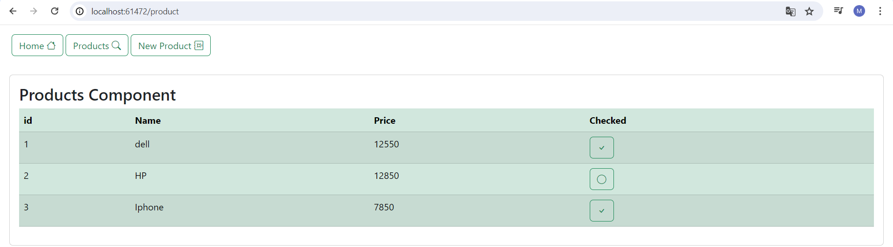
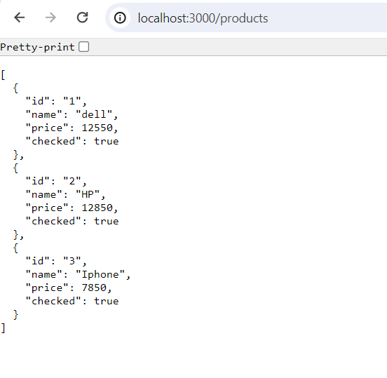
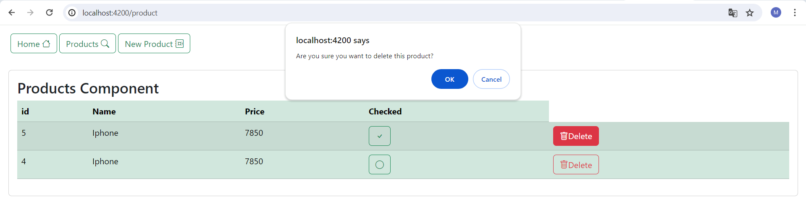

<h1>une application web Angular qui permet de gérer des produits avec un backend basé sur Json-server</h1>

1. affichage de la liste des produits 

2.un backend base sur Json-server 

3.supprimer un produit 

4.ajouter un produit 

